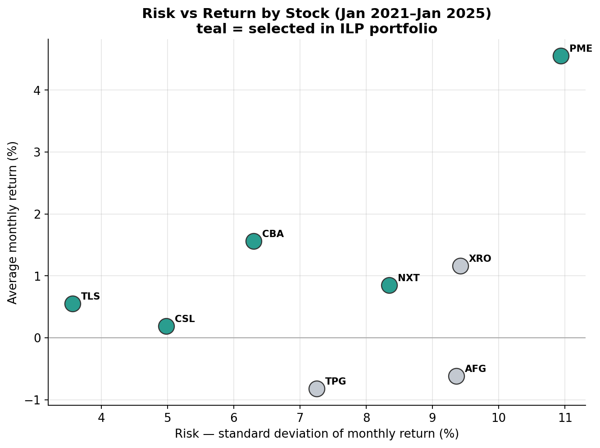
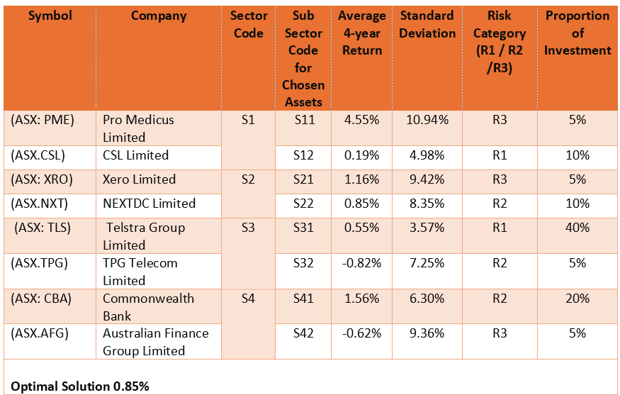
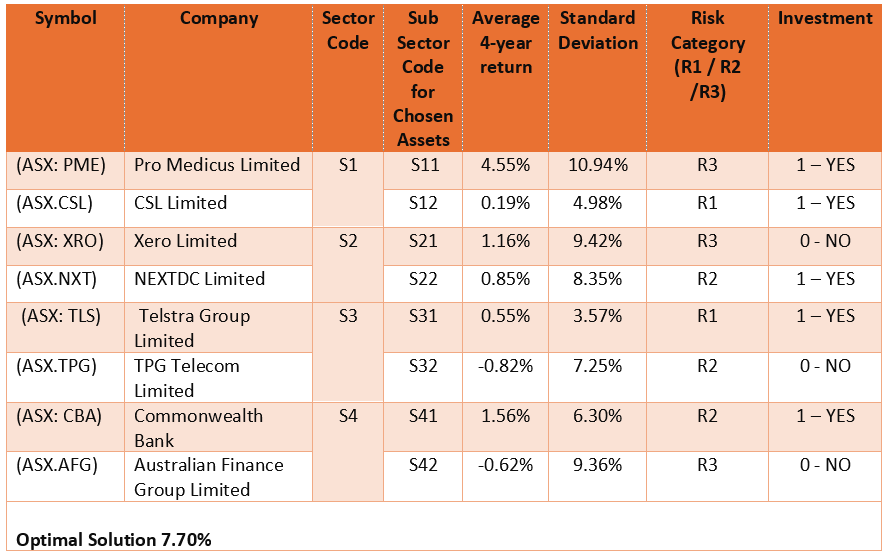
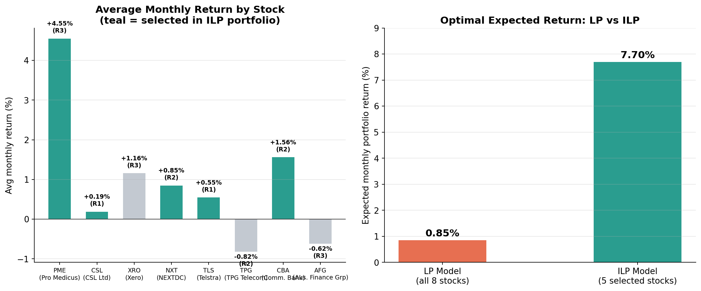
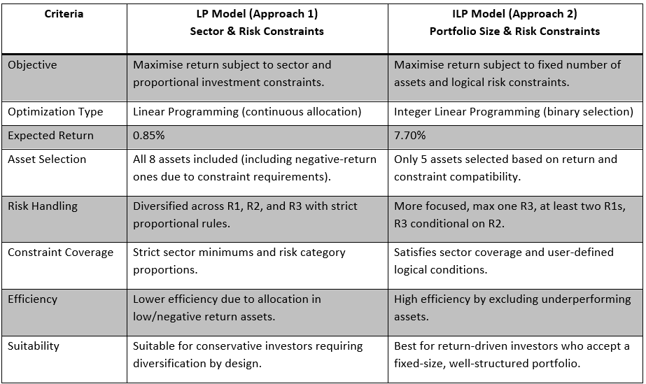

# ASX Investment Portfolio Optimisation

Postgraduate coursework project (MIS775 — Decision Modelling for Business Analytics) evaluating two linear-programming approaches to constructing an optimal share portfolio from eight ASX-listed stocks, using 49 months of price history (January 2021 – January 2025).

## The brief

Build a portfolio across four sectors — Healthcare, Technology, Communication Services and Financials — balancing expected return against risk category (R1 low / R2 medium / R3 high, based on standard deviation of monthly returns). Two optimisation approaches were compared: a **Linear Programming (LP)** model allocating proportionally across all 8 stocks, and an **Integer Linear Programming (ILP)** model selecting a fixed subset of 5.

  

## Approach 1 — Linear Programming

The LP model maximises expected return subject to proportional constraints: no more than 15% in R3 (high-risk) assets, at least 25% in R2 (medium-risk), sector minimums (15% each, 20% for Financials), and a 5% minimum per stock. Because every stock had to be included at some weight, negative-return assets (TPG, AFG) were forced into the portfolio to satisfy sector and risk-category minimums.

  

**Optimal LP return: 0.85% per month.**

Sensitivity analysis showed several binding constraints actively capping performance: the 15% R3 cap has a positive shadow price (0.0335) — relaxing it would unlock higher-return assets — while the 25% R2 minimum has a negative shadow price (–0.0553), forcing capital into weaker performers like TPG.

## Approach 2 — Integer Linear Programming

The ILP model instead selects exactly 5 stocks (binary in/out), with logical constraints: all 4 sectors represented, at most one R3 asset, at least two R1 assets, and an R3 selection only permitted alongside an R2 selection.

  

**Optimal ILP return: 7.70% per month** — selecting Pro Medicus (PME), CSL, NEXTDC (NXT), Telstra (TLS) and Commonwealth Bank (CBA), while correctly excluding both negative-return assets (TPG, AFG) and Xero (XRO), whose return didn't justify displacing a higher performer under the risk constraints.

## LP vs ILP

  

  

| | LP Model | ILP Model |
|---|---|---|
| Expected return | 0.85% | **7.70%** |
| Asset selection | All 8 (incl. negative-return) | 5, chosen on merit |
| Risk handling | Proportional across R1/R2/R3 | Max 1×R3, min 2×R1 |
| Best suited to | Conservative investors wanting forced diversification | Return-driven investors accepting a concentrated, well-structured portfolio |

## Recommendation

**The ILP model is the preferred strategy.** It delivers a materially higher expected return by excluding assets that only existed in the LP solution to satisfy rigid proportional constraints, while still meeting sector coverage and risk-balance requirements through logical (rather than proportional) rules. The suggested refinement for future iterations is to replace hard proportional thresholds in the LP model with flexible target ranges, which sensitivity analysis suggests would materially improve its return without abandoning diversification.

## Methodology

- Sourced 49 months of closing prices per stock (Jan 2021–Jan 2025) and computed monthly rates of return
- Classified each stock into a risk category (R1/R2/R3) by standard deviation of monthly returns
- Built and solved the LP model in Excel Solver; extracted the sensitivity report to interpret shadow prices and reduced costs
- Built and solved the ILP model with binary decision variables and logical constraints
- Compared both models on expected return, risk handling and practical suitability

## Repository contents

- [`ASX-portfolio-optimisation-model.xlsx`](ASX-portfolio-optimisation-model.xlsx) — the full working model: price/return data, LP and ILP Solver setups, sensitivity report
- `images/` — charts and worksheet/output summary tables referenced above

---
*Author: Jayendra Weerakoon. MIS775 — Decision Modelling for Business Analytics, Assignment 1.*
